# Техническое задание — Omnicomm Fleet Report

> Глубокое ТЗ с функциональными требованиями, статусом реализации и картой разработки.
> Документ разделён на две части: **A. Платформа** и **B. Отчёт-презентация**.
> Дата ревизии: 2026-06-12. Источник статусов — аудит кодовой базы (`src/omnicomm_report/`).

Условные обозначения статуса:
✅ реализовано · 🟡 частично / оценка · ❌ не реализовано · 🆕 новое требование (этой итерации)

---

## 0. Паспорт проекта

| Параметр | Значение |
|---|---|
| **Продукт** | Python-инструмент автоматического анализа данных автопарка Omnicomm Online → готовый клиентский отчёт уровня коммерческой презентации |
| **Заказчик** | Горкомтранс (Караганда, вывоз ТКО, ~70 мусоровозов/спецтехники) |
| **Интегратор** | Компания «Альянс» |
| **Бизнес-модель** | «Отчёт как услуга» — мульти-клиентская платформа, отчёт по подписке/запросу |
| **Источники данных** | Omnicomm REST API (боевой контур `kz.omnicomm.online`, демо `online.omnicomm.ru`) или Excel/CSV |
| **Форматы на выходе** | `.pptx` (основной) · `.html` (+печать в PDF) · `.xlsx` · `.pdf` (опц. LibreOffice) |
| **Валюта оценок** | Тенге (₸) |
| **Стек** | Python 3.10+ · requests · pandas · openpyxl · matplotlib · python-pptx · streamlit · playwright |
| **Персистентность** | JSON-файлы (`data/`, `output/`), без БД. Всё в `.gitignore` |

### Конвейер обработки

```
источник → data_loader → validator → analytics → charts/svg_charts → report_builder → .pptx/.html/.xlsx/.pdf
   │           │            │            │              │                  │
 API/Excel  VehicleMetrics  аномалии   FleetKPI    PNG + inline-SVG   слайды/таблицы
```

Единый контракт данных — `models.py` (`VehicleMetrics`, `FleetKPI`, `FleetReport`). Источник (API/Excel) абстрагирован в `data_loader`; остальной конвейер от источника не зависит.

---

# ЧАСТЬ A. ПЛАТФОРМА

Мульти-тенантное Streamlit-приложение: учётка/настройки клиента вводятся один раз, далее «выбрал клиента → период → клик → отчёт». Разграничение доступа по двум ролям, журналирование всех действий, авторассылка по расписанию.

## A1. Аутентификация и роли

| Требование | Статус | Реализация |
|---|---|---|
| Форма входа (логин/пароль) | ✅ | `app.py:226–242` |
| Хеширование паролей платформы | ✅ | PBKDF2-SHA256, 200k итераций, уникальная соль — `auth.py:27–30,56–66` |
| Засев администратора при первом запуске | ✅ | `auth.ensure_admin()` — пароль из `ADMIN_PASSWORD` или генерируется, показывается однократно `auth.py:88–96` |
| Роль **admin** — полный доступ | ✅ | отчёты, парк/нормы, шаблоны, клиенты, пользователи, планировщик, журнал `app.py:266–275` |
| Роль **manager** — операционный доступ | ✅ | только формирование/просмотр отчётов `app.py:277` |
| Управление пользователями (CRUD) | ✅ | экран «Пользователи», только admin `app.py:681–713` |
| Сессия и выход | ✅ | `st.session_state`, `audit.log("logout")` `app.py:259–263` |
| Привязка действий к актору | ✅ | `audit.set_actor(USER)` `app.py:247` |

**Экран входа:**

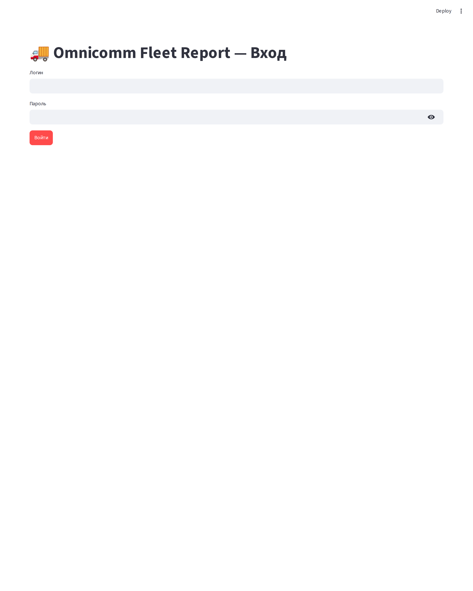

**Пробелы:** только 2 уровня ролей (нет «только просмотр», «редактор норм»); нет привязки менеджера к подмножеству клиентов (видит журнал всех).

## A2. Мульти-клиентность

| Требование | Статус | Реализация |
|---|---|---|
| Регистрация клиента (форма) | ✅ | название, URL контура, логин/пароль Omnicomm, сервис, цена ГСМ, email, GPS-опция `app.py:283–305` |
| Хранение конфига per-client | ✅ | `data/clients/<slug>.json` (gitignored, chmod 0600) `clients.py:72–115` |
| Список/загрузка/удаление клиентов | ✅ | `clients.py:41–123` |
| Обфускация пароля Omnicomm | 🟡 | base64 — **песочница, не криптостойко**; для прода → шифрование/KMS `clients.py:30–38` |

**Экран «Новый клиент»:**

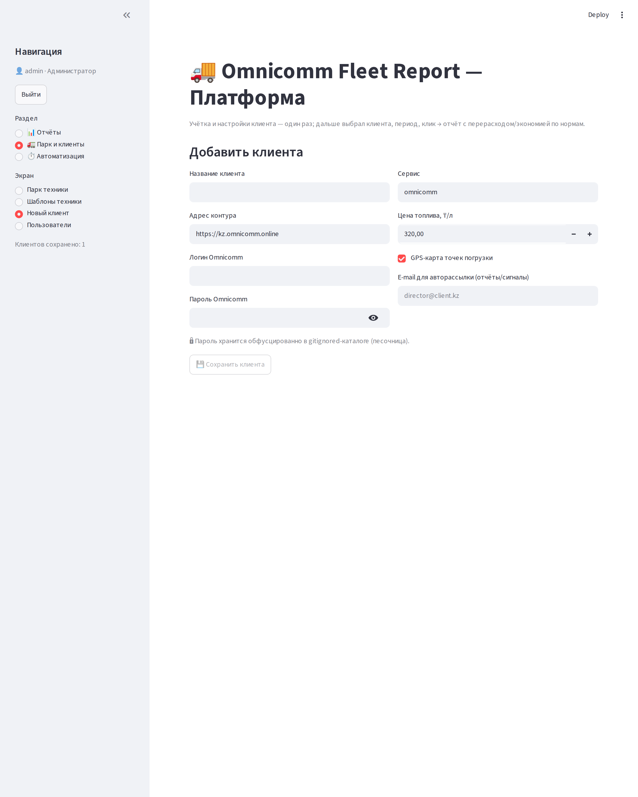

## A3. Формирование отчёта (главный экран)

| Требование | Статус | Реализация |
|---|---|---|
| Выбор клиента, периода (пресет/произвольный) | ✅ | `app.py:307–331` |
| Цена ГСМ + сверка с поставщиком (лето/зима) | ✅ | Royal Petrol через `fuel_price.get_reference()` `app.py:330–346` |
| Календарь цен ГСМ (история по датам) | ✅ | `app.py:348–369`, `price_history.py` |
| Настройка email + чекбоксы «Отчёт»/«Сигналы» | ✅ | `app.py:371–380` |
| Расписание авторассылки (inline) | ✅ | `app.py:385–418` |
| Фильтр ТС, GPS-карта (опц.) | ✅ | `app.py` |
| Кнопка «Сформировать отчёт» + вывод KPI и скачивание | ✅ | `.pptx/.html` `app.py` |
| Отчёт из файла (Excel/CSV upload) | ✅ | `app.py:476–516` |

**Главный экран «Отчёт по клиенту»:**

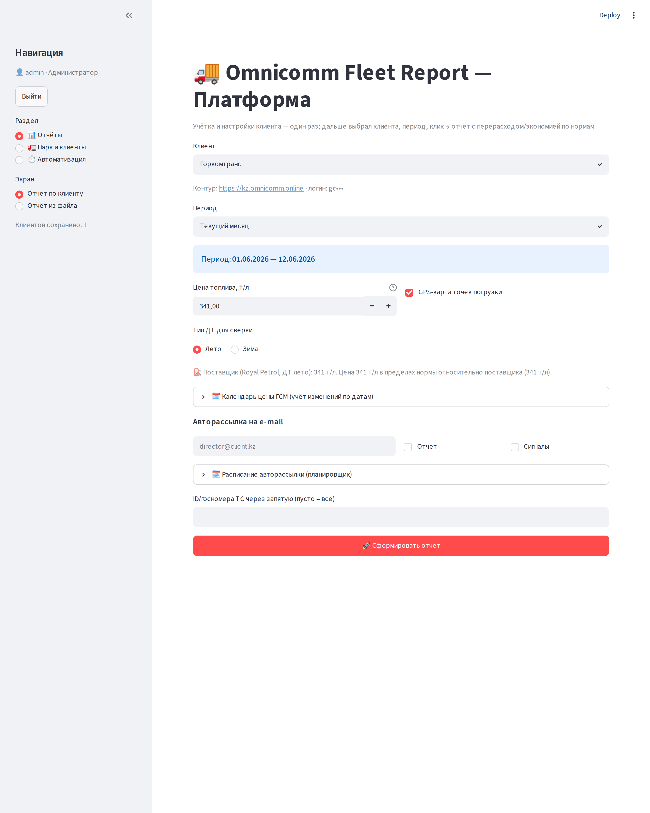

## A4. Парк, паспорта и нормы

| Требование | Статус | Реализация |
|---|---|---|
| Загрузка списка ТС из Omnicomm | ✅ | «Загрузить парк из Omnicomm» `app.py:570–575` |
| Редактор паспортов (тип, марка, модель, двигатель, госномер) | ✅ | `st.data_editor` `app.py:560–628` |
| Ввод норм л/100км и л/моточас (паспорт/замер) | ✅ | сохранение в `output/norms/<slug>.json` `norms.py:44–52` |
| Расчёт перерасхода/экономии по нормам (₸) | ✅ | модель списания РК: combined / 100km / mh `norms.py:106–136` |
| Коэффициенты к норме (зима +10%, свалка +15%, город +10%, износ +5%) | ✅ | `norms.py:102`, `config.py:40` |

**Экран «Парк техники — паспорта и нормы»** (таблица норм появляется после загрузки парка из Omnicomm):

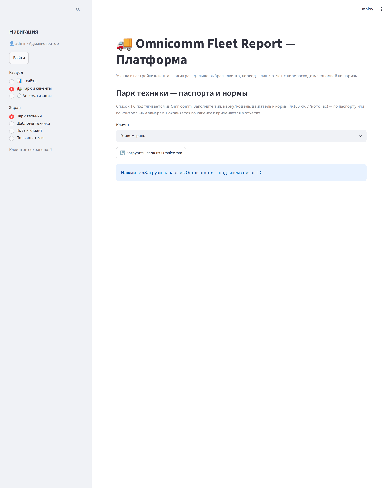

**Пробел:** нормы привязаны к **имени** ТС — при переименовании теряются (нужен ID-маппинг).

## A5. Шаблоны типов техники

| Требование | Статус | Реализация |
|---|---|---|
| Заводские профили типов (11 шт) | ✅ | мусоровоз, поливомоечная, экскаватор, кран, погрузчик, трактор, самосвал, грузовой, автобус, легковой, прочее `vehicle_types.py:35–59` |
| Профиль управляет расчётной метрикой | ✅ | `primary_metric` ∈ {l_per_100km, l_per_mh, both}, `stationary_work` |
| Авто-классификация по имени + кинематике | ✅ | `vehicle_types.py:128–145` |
| Редактор шаблонов в UI | ✅ | `data/vehicle_types.json` `app.py:630–663` |

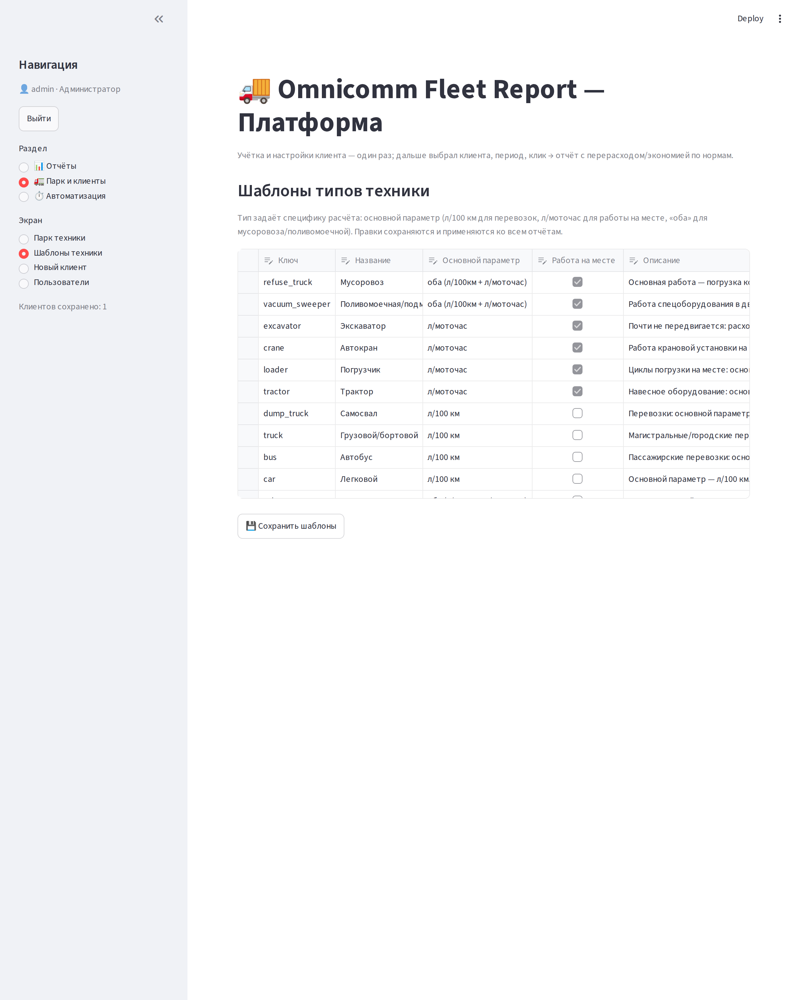

## A6. Планировщик и демон авторассылки

| Требование | Статус | Реализация |
|---|---|---|
| Расписание per-client (ежедневно/еженедельно/ежемесячно, час UTC, период) | ✅ | хранится в конфиге клиента `app.py:385–418` |
| Демон-планировщик (бесконечный цикл, тик 60с) | ✅ | `python -m omnicomm_report.scheduler` `scheduler.py:256–274` |
| Идемпотентность слота (выполнить один раз) | ✅ | `is_due()`/`last_occurrence()` `scheduler.py:86–116` |
| Прогон для клиента (опрос→анализ→отчёт→email) | ✅ | `run_for_client()` `scheduler.py:173–233` |
| Heartbeat живучести демона (🟢/🔴 в UI) | ✅ | `data/scheduler_heartbeat.json`, порог 180с `scheduler.py:157–168` |
| Ежедневный снимок цены ГСМ в календарь | ✅ | `snapshot_fuel_price()`, кулдаун 1ч `scheduler.py:46–81` |
| Ручной запуск «Запустить сейчас» | ✅ | `app.py:552–558` |

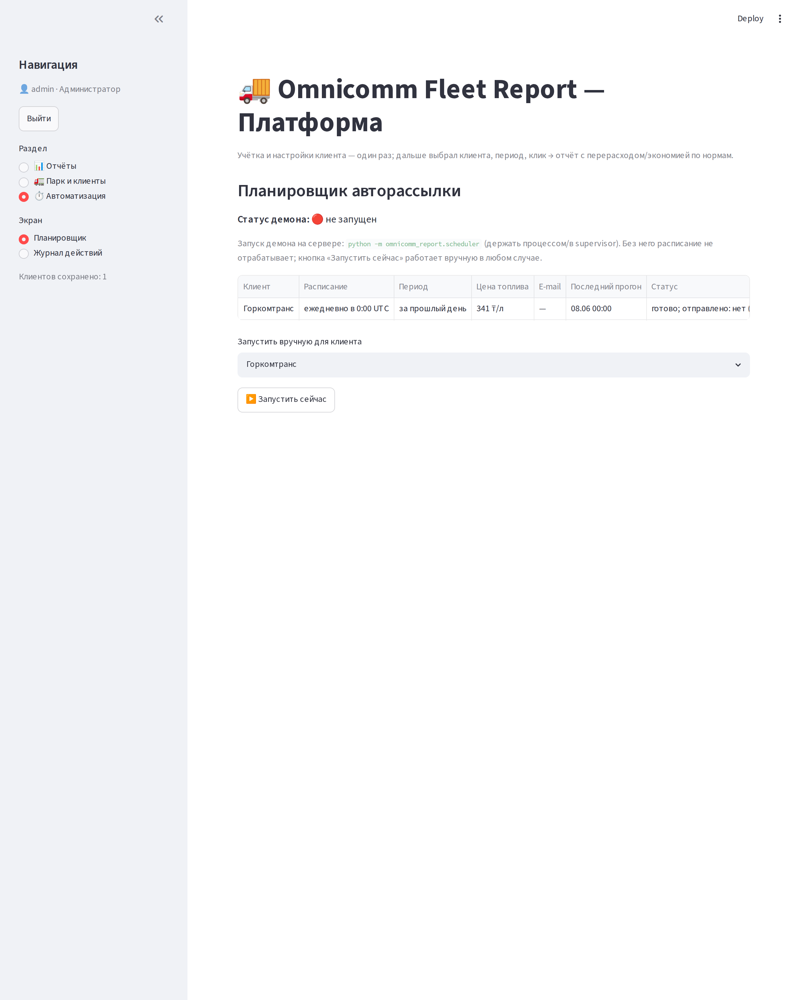

**Пробел:** демон не обёрнут в systemd/supervisor (нужен внешний контроль перезапуска); гранулярность ±1 мин.

## A7. Рассылка (SMTP)

| Требование | Статус | Реализация |
|---|---|---|
| Отправка отчёта с вложениями (.pptx/.html/.xlsx/.pdf) | ✅ | `mailer.send_report()` `mailer.py:37–79` |
| Отправка авто-сигналов | ✅ | `alerts.send_alerts()` `alerts.py` |
| Конфиг SMTP из ENV (HOST/USER/PASSWORD/PORT/TLS) | ✅ | `mailer.py:31–34` |
| Сбой сети не валит прогон (graceful) | ✅ | логирование, возврат False |

**Пробелы:** нет UI-настройки SMTP (только ENV); нет retry; нет CC/BCC/Reply-To.

## A8. Журнал действий (аудит)

| Требование | Статус | Реализация |
|---|---|---|
| Логирование login/logout, отчётов, клиентов, норм, расписаний, пользователей, цен | ✅ | `audit.log()` по всему `app.py` + `scheduler.py` |
| Хранилище JSONL | ✅ | `data/audit/audit.jsonl`: `{ts, action, client, actor, details}` `audit.py:44–58` |
| Просмотр журнала с фильтром по клиенту | ✅ | `audit.recent()` `app.py:665–679` |

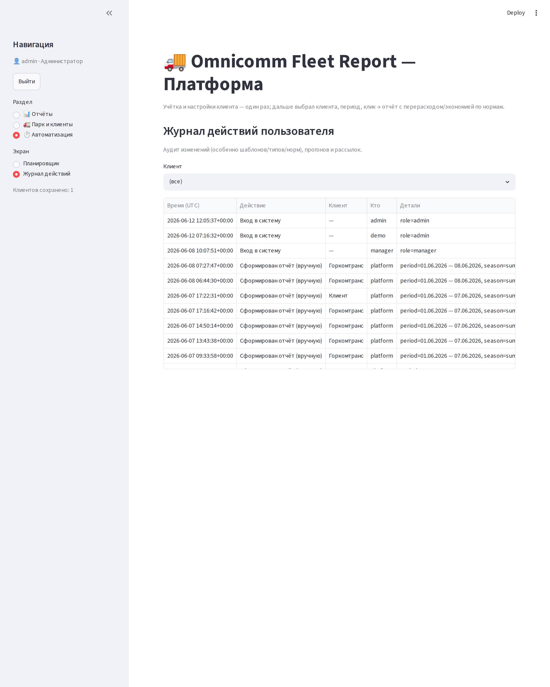

**Управление пользователями:**

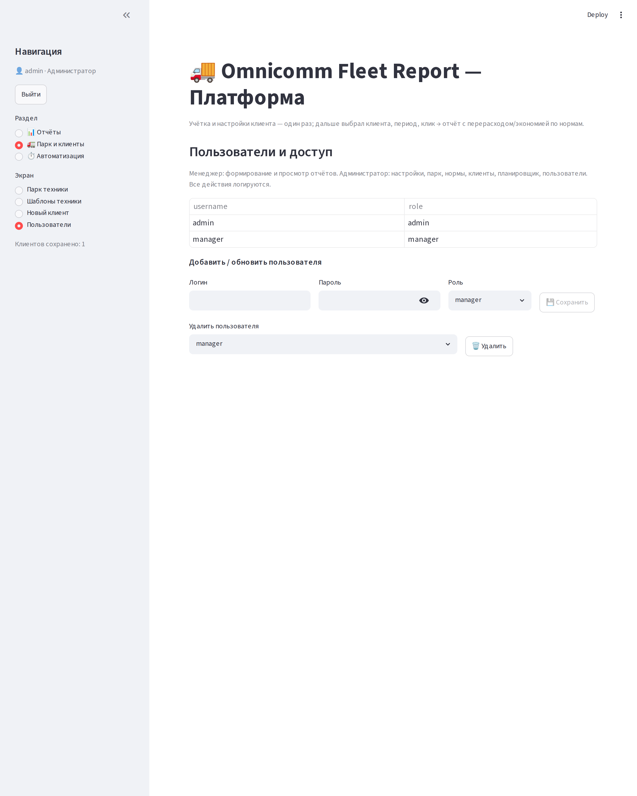

## A9. Источники данных и API

| Требование | Статус | Реализация |
|---|---|---|
| Авторизация `POST /auth/login?jwt=1`, заголовок `Authorization: JWT <token>` | ✅ | `api_client.py` |
| Упреждающий refresh + ретраи + паузы | ✅ | `api_client.py:236–365` |
| Дерево ТС `GET /ls/api/v2/tree/vehicle` + рекурсивный флэттен | ✅ | `api_client.py:413–440` |
| Сводный отчёт **POST** `consolidatedReport` (≤50 ТС / ≤31 дня) | ✅ | батчинг + нарезка периода `api_client.py:374–409` |
| Единицы: топливо дл→л (÷10), время сек→ч (÷3600) | ✅ | `data_loader.py:350–406`, `config.py:74–79` |
| Коды ошибок 0–15; 5/7/9/10/11 не прерывают отчёт (`has_data=False`) | ✅ | `config.py:205–222`, `api_client.py:354–365` |
| GPS-трек `GET /reports/track/{id}` + фильтр >200 км/ч | ✅ | `api_client.py:464–492`, `config.py:61–71` |
| Геозоны-площадки (визиты) | ✅ | `get_geozones_report()` `api_client.py:453–462` |
| Excel/CSV: синонимы заголовков, парсинг «грязных» чисел, отсев «сливов» | ✅ | `data_loader.py:39–116` |
| Журнал событий / активность / водители / последний пакет (live-местоположение) | 🟡 | эндпоинты в `config.py:142–156`, но **публичные методы не реализованы** |

**Пробел (важно для live-дашборда):** нет метода для «последнего пакета» / текущего местоположения ТС — `events`, `activity/vehicles`, `drivers`, `links` объявлены в конфиге, но не вызываются.

## A10. Цены ГСМ

| Требование | Статус | Реализация |
|---|---|---|
| Парсер цены поставщика (Royal Petrol, playwright) | 🟡 | при смене разметки сайта возможен сбой → fallback на ручной ввод `fuel_price.py:82–119` |
| Кэш цены (6 ч) | ✅ | `data/fuel_price_cache.json` `fuel_price.py:122–159` |
| Сверка ручной цены с эталоном (±15%) | ✅ | `check_price()` `fuel_price.py:162–176` |
| Календарь цен: средневзвешенная по дням периода | ✅ | `price_history.effective_price()` `price_history.py:110–136` |
| Чек-поинт лето/зима ДТ | ✅ | `fuel_price.py` |

## A11. Безопасность и хранение

| Аспект | Статус | Примечание |
|---|---|---|
| Пароли платформы — PBKDF2 | ✅ | криптостойко |
| Пароли Omnicomm-клиентов — base64 | 🟡 | песочница; для прода → шифрование/секрет-хранилище |
| Файлы данных chmod 0600 | ✅ | `clients.py`, `auth.py`, `scheduler.py` |
| `.env`, `data/`, `output/*` в `.gitignore` | ✅ | коммитится только `.env.example` |
| Шифрование данных в покое | ❌ | JSON открыты при доступе к ФС |
| Масштабирование (БД, объектное хранилище) | ❌ | файловое хранилище — для MVP/песочницы |

---

# ЧАСТЬ B. ОТЧЁТ-ПРЕЗЕНТАЦИЯ

Готовый управленческий документ, а не техническая выгрузка: выводы для руководства, официальный стиль, без обвинений, деньги в ₸. Сборка — `report_builder.py` (.pptx/.html/.xlsx/.pdf), графики — `charts.py` (11 matplotlib-PNG) и `svg_charts.py` (3 hero-SVG для HTML).

## B1. Форматы вывода

| Формат | Статус | Реализация |
|---|---|---|
| `.pptx` 16:9, ручная вёрстка слайдов | ✅ | `build_pptx()` `report_builder.py:878` |
| `.html` самодостаточный (PNG base64 + inline-SVG), печать в PDF | ✅ | `build_html()` `report_builder.py:1326` |
| `.xlsx` (листы KPI + ТС, без «сливов») | ✅ | `export_xlsx()` `report_builder.py:1069` |
| `.pdf` через LibreOffice (graceful, опц.) | 🟡 | `export_pdf()` — если нет `soffice`, не падает `report_builder.py:1141` |

## B2. Метрики — полная карта

Базовые метрики ТС/парка (`models.py`, `analytics.py`):

| Метрика | Статус | Поле / расчёт |
|---|---|---|
| Пробег, км | ✅ | `mileage_km` |
| Время работы двигателя (моточасы) | ✅ | `engine_hours` (сек/3600) |
| Время ДВС в движении | ✅ | `movement_hours = engine_hours − idle_hours` `analytics.py:104` |
| Время ДВС без движения | ✅ | `engine_idle_hours` |
| Расход топлива общий, л | ✅ | `fuel_l` (дл/10) |
| Расход без движения, л | ✅ | `fuel_idle_l` |
| Расход л/100 км | ✅ | `fuel_per_100km_calc` = fuel/mileage×100; средневзвеш. по парку |
| Расход л/час (моточас) | ✅ | `fuel_per_motorhour` = fuel/engine_hours `models.py:128–132` |
| Пробег с превышением скорости, % | ✅ | `speeding_mileage_share` = speeding_km/mileage `analytics.py:142` |
| Время холостого хода (доля) | ✅ | `idle_hours_share`, цель 5% (`IDLE_TARGET_SHARE`) |
| Макс. скорость (с фильтром GPS-сбоев) | ✅ | `max_speed_kmh`, отсев >200 км/ч |
| **Коэффициент использования авто (% времени в работе)** | 🟡🆕 | сейчас есть `loading_utilization` = полезная погрузка / работа стоя (другой смысл). Нужен **эксплуатационный коэф.** = `engine_hours / нормативный фонд` — см. B4 |
| **Нарушения режима труда и отдыха (РТО)** | ❌🆕 | требует **по-пакетного журнала** (непрерывные интервалы), а не суточной сводки — см. B4 |

Финансы и нормы:

| Метрика | Статус | Расчёт |
|---|---|---|
| Стоимость топлива, ₸ | ✅ | `total_fuel_l × fuel_price_kzt` |
| Стоимость простоя, ₸ | ✅ | `idle_fuel_cost` |
| Перерасход / экономия к нормам, ₸ | ✅ | `norms.py`, сальдо по парку |
| Потенциальная экономия (−10/20/30% простоя) | ✅ | `build_whatif` `analytics.py:514` |
| Скоринг проблемных ТС | ✅ | `build_scorecard` (перерасход+простой+превышения) `analytics.py:524` |
| Бенчмарк парков (обезличенно, ≥2 чужих) | 🟡 | требует историю др. клиентов `benchmark.py` |
| Тренды период-к-периоду | ✅ | `history.py` + `compute_trends` |

## B3. Структура слайдов

12–16 слайдов (динамически от данных). Порядок — `build_pptx()` `report_builder.py:878+`:

1. **Титул** — клиент, период, 4 KPI-карточки ✅
2. **Ключевые выводы для руководства** ✅
3. **Профиль автопарка** (таблица, без «сливов», дробление >15 ТС) ✅
4. **Структура парка** (пончик: подвижная/спецтехника) ✅
5. **Пробег и распределение нагрузки** ✅
6. **Топливная эффективность** — подвижная (л/100км) + спецтехника (л/мч) ✅
7. **Использование парка** (stacked: движение/холостой) ✅
8. **Расход без движения** (пончик доли) ✅
9. **Куда уходят деньги (₸)** + стоимость по ТС ✅
10. **Перерасход/экономия по нормам (₸)** (divergent bar + таблица) ✅
11. **Операционные отклонения** (превышения, только REVIEW) ✅
12. **Работа на погрузке** (датчик/оценка, журнал геозон) 🟡
13. **Сигналы и приоритеты** + потенциал экономии ✅
14. **Рекомендации и план действий** ✅

**Экран для руководителя (hero, .html):**

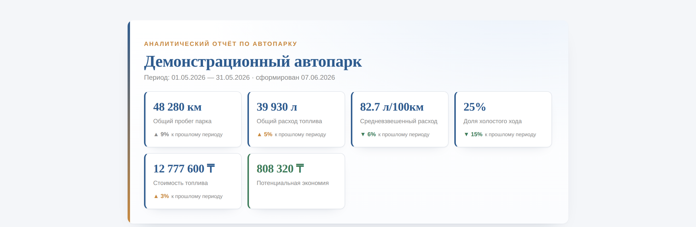

**Профиль автопарка:**

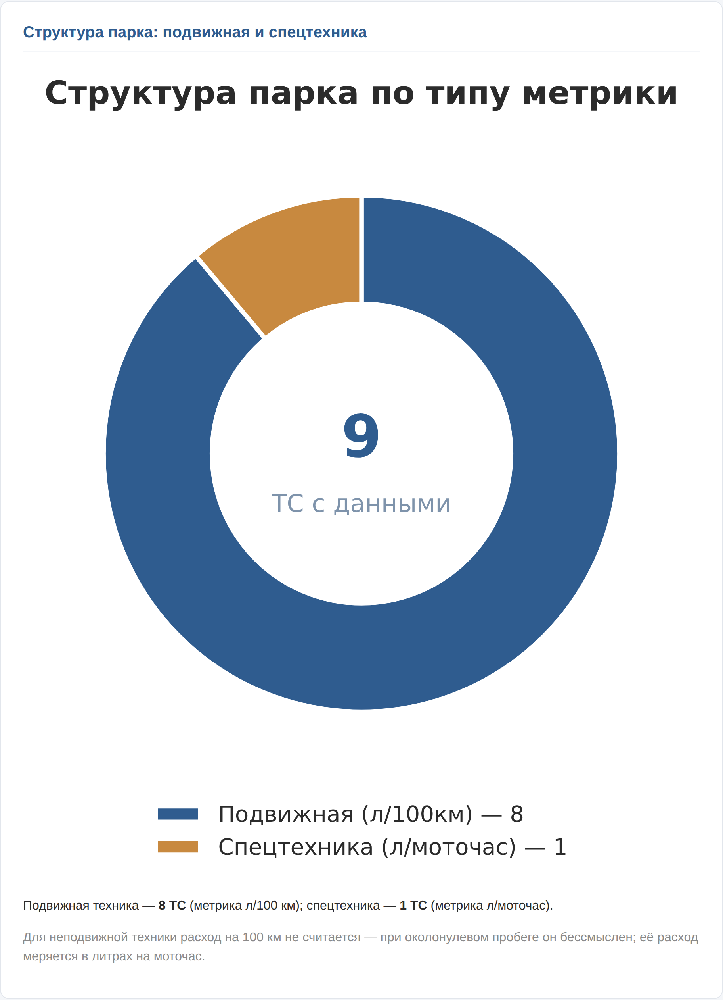

**Топливная эффективность:**

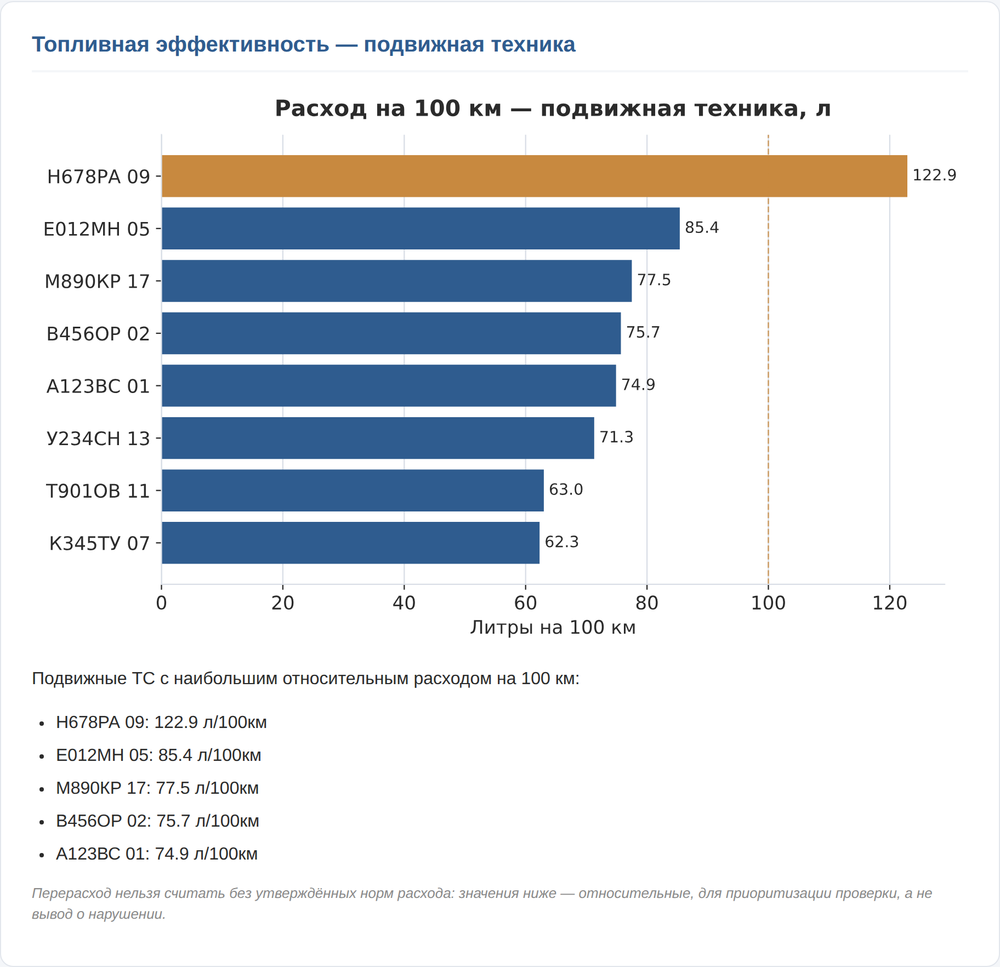

**Использование парка:**

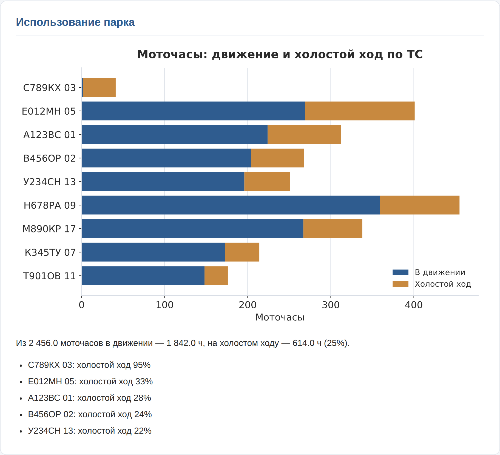

**Куда уходят деньги (₸):**

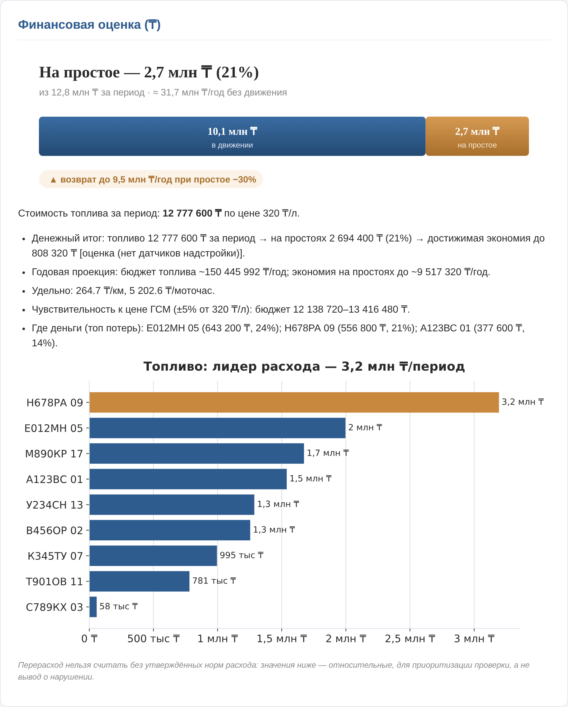

**Работа на погрузке:**

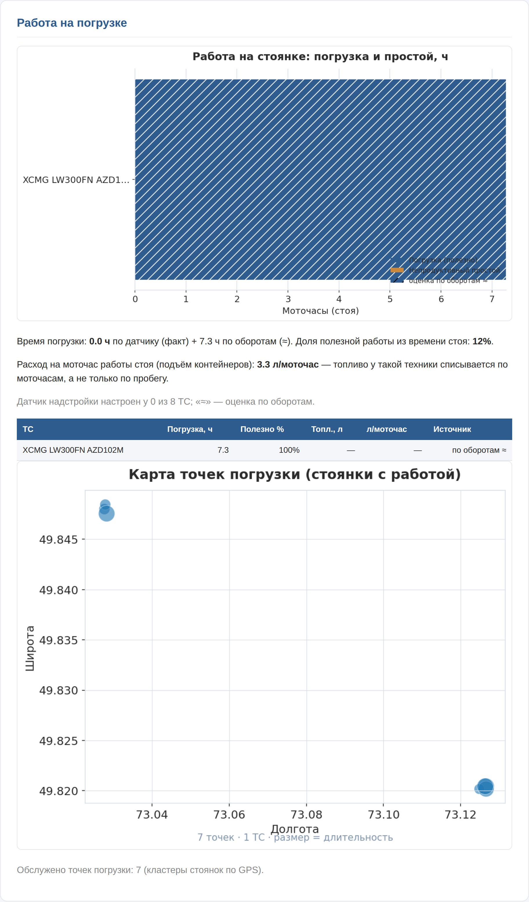

**Рекомендации:**

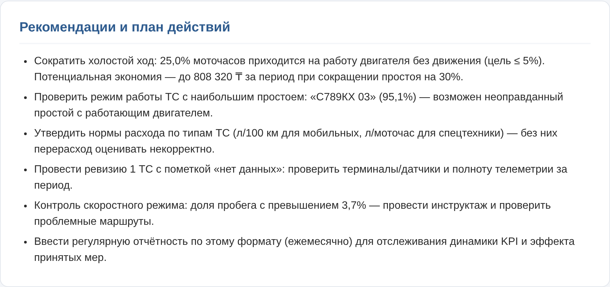

## B4. Бизнес-инварианты (обязательны)

| Инвариант | Статус | Контроль |
|---|---|---|
| Столбец «возможные сливы топлива» НИКОГДА не выводится | ✅ | проверено в .pptx/.xlsx/.html `report_builder.py:405,1073,1293` |
| Аномалии только `severity=REVIEW` («требует проверки»), без обвинений | ✅ | `_review_anomalies()` `report_builder.py:521` |
| Перерасход не утверждать без согласованных норм | ✅ | условие `vehicles_with_norm>0` + дисклеймер |
| Светлый корпоративный стиль (синий #2F5C8F, янтарь #C8893F на зонах внимания) | ✅ | единая палитра charts/report/svg |
| Деньги — в тенге (₸) | ✅ | сквозь весь конвейер |

---

# C. Новые требования этой итерации

## C1. Коэффициент использования автомобиля 🆕

**Вопрос:** как считать — ДВС / время смены? **Решение:** длины смены в телеметрии нет → ввести **нормативный фонд времени per-client** в `norms.py`/конфиг клиента. Считать две честные метрики:
- **Технический коэф.** = `engine_hours / календарный период` (всегда доступен);
- **Эксплуатационный коэф.** = `engine_hours / нормативный фонд` (если задан фонд: например 8 ч/сут или 24/7).

**Задача:** добавить поле `time_fund_hours_per_day` в конфиг клиента + расчёт в `analytics` + слайд/карточку.

## C2. Расход л/час 🆕(вывод)

`fuel_per_motorhour` уже считается (`models.py:128`). **Задача:** вывести как явную KPI-карточку и колонку (сейчас используется в основном для спецтехники/норм).

## C3. Нарушения режима труда и отдыха (РТО) ❌🆕

Непрерывные интервалы работы/движения > N часов без перерыва. **`consolidatedReport` агрегирует по суткам — оттуда не вытащить.** Требует отдельного конвейера на **по-пакетном журнале/треке**. Фаза 2. Управлять ожиданиями заказчика.

## C4. Дашборд руководителя автопарка 🆕

Принципиально: **это отдельный live-продукт**, а не слайд в pptx за прошлый период. Realtime-пункты в pptx бессмысленны.

| # | Пункт дашборда | Носитель | Статус | Комментарий |
|---|---|---|---|---|
| 1 | Авто в работе / простое (сейчас) | live | ❌🆕 | нужен последний пакет / activity-эндпоинт (A9-пробел) |
| 2 | Пробег за сегодня | live | 🟡🆕 | данные есть, но «за сегодня» = realtime-срез |
| 3 | Расход топлива за сегодня | live | 🟡🆕 | то же |
| 4 | Топ-10 нарушителей по скорости | оба | ✅ | `speeding`, scorecard |
| 5 | Топ-10 по простою | оба | ✅ | `idle_hours_share`, рейтинг |
| 6 | Рейтинг водителей | — | ❌ | **не работает**: нет привязки водитель↔ТС/идентификации → **замена: рейтинг ТС/бортов** (по перерасходу/простою/превышениям) — уже есть `build_scorecard` |
| 7 | Карта текущего местоположения | live | 🟡🆕 | брать координаты последнего пакета из Журнала (эндпоинт не реализован, A9) |
| 8 | Прогноз затрат на обслуживание (месяц) | оба | 🟡🆕 | данных о наработке узлов/истории ТО нет → честно «**оценка по наработке**» (пробег/моточасы × ставка), не «прогноз» |
| 9 | KPI автопарка | оба | ✅ | агрегаты FleetKPI |

## C5. Особенность детекции ДВС (для Горкомтранс) 🆕

Если работа ДВС берётся **не с генератора, а по порогу напряжения** — нагрузку не видим, только время работы ДВС. Тогда:
- «Время работы ДВС без движения» (`work_no_move_hours`) — выводим честно;
- «Холостой ход» (непродуктивный) — **нельзя достоверно отделить от продуктивной погрузки** → помечать «оценка недоступна без датчика нагрузки», не натягивать.

Это уже отражено в модели: `work_no_move_hours` vs `unproductive_idle_hours`. **Открытый вопрос к заказчику:** как настроена детекция ДВС на парке.

---

# D. Сводный статус реализации

**Платформа:** все 11 подсистем (A1–A11) реализованы; ограничения — безопасность хранения паролей Omnicomm (base64), файловое хранилище, демон без systemd, нет live-эндпоинтов журнала.

**Отчёт:** 12–16 слайдов, 11 PNG-графиков + 3 hero-SVG, 4 формата вывода, все бизнес-инварианты соблюдены.

**Боевой прогон (май 2026, Горкомтранс, 62 из 70 ТС)** — выполнен. Главный вывод: «парк в норме по удельному расходу, деньги — в простое»: холостой ход **47,5% моточасов** ≈ **93,5 млн ₸/год**; потенциал −10/20/30% = **9,3 / 18,7 / 28 млн ₸/год**.

**Слепые зоны прогона:** 0 из 62 ТС с надстроечными датчиками (дуальная норма — оценка по оборотам); 8 «тёмных» ТС; единые дефолтные нормы (38 л/100км + 5,5 л/мч).

---

# E. Карта разработки

## P0 — целостность данных (блокирует достоверность)
1. Индивидуализировать нормы по паспортам ТС (убрать единый дефолт). [A4 готов как механизм — нужны данные заказчика]
2. Разобрать 8 «тёмных» ТС (права/период/блокировки).
3. Уточнить у заказчика детекцию ДВС (генератор/обороты/напряжение) → судьба «холостого хода» и модуля погрузки (C5).
4. План оснащения надстроечными датчиками (пилот 5–10 мусоровозов).

## P1 — деньги + достоверность
1. Программа сокращения холостого хода (целевой слайд → 9–28 млн ₸/год).
2. Коэффициент использования: нормативный фонд per-client + 2 метрики (C1).
3. Расход л/час как явная KPI-карточка (C2).
4. Класс-зависимые фильтры GPS-скорости (мусоровоз ≠ 168 км/ч) — частично есть `MAX_PLAUSIBLE_SPEED_BY_TYPE`.

## P2 — новые продукты / нужны данные
1. **Live-дашборд руководителя** (C4): реализовать `activity/vehicles` + «последний пакет» в `api_client`, отдельный экран; пункты 1–3,7 realtime, карта местоположения.
2. **Нарушения РТО** (C3): конвейер по-пакетного журнала.
3. **Оценка затрат на ТО** по наработке (C4 п.8) — честная эвристика.
4. Геозоны площадок → ₸/контейнер, ₸/тонна.
5. Бенчмарк по мере накопления истории клиентов.

## P3 — продакшен-готовность платформы
1. Шифрование паролей Omnicomm (замена base64 → AES/KMS).
2. БД вместо JSON (клиенты, аудит, история); объектное хранилище отчётов.
3. Демон-планировщик в systemd/supervisor.
4. UI-настройка SMTP + retry рассылки.
5. ID-маппинг норм (устойчивость к переименованию ТС).

---

# F. Открытые вопросы к заказчику

1. **Детекция ДВС на парке** — генератор/обороты или порог напряжения? (определяет достоверность «холостого хода» и погрузки)
2. **Дашборд руководителя** — live-экран в платформе или сводка в pptx? (от этого зависит, тянем ли realtime-источник)
3. Подтвердить права REST API и точный адрес боевого контура.
4. Согласовать перечень KPI титульного слайда.
5. Нормативный фонд времени для коэффициента использования (8 ч/сут? 24/7? по типу техники?).
